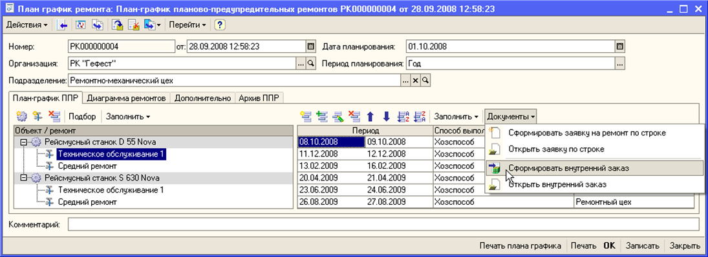

# Пояснительная записка

## Введение

Пишется по завершению проектирования и реализации информационной системы.

## 1. Анализ технического задания

### 1.1. Формулировка задания на курсовую работу

Целью курсовой работы является проектирование и реализация базы данных "Планирование ремонтных работ". Проект этой информационной системы отражает этапы создания базы данных с использованием СУБД FireBird 2.5, а также клиентского приложения с использованием среды разработки Visual Studio. Для того, чтобы выполнить поставленную цель, были сформулированы следующие задачи:

1. Провести анализ предметной области.
2. Разработать формальные требования к хранимым в БД данным.
3. Разработать структуру БД.
4. Разработать клиентское приложение.

### 1.2. Описание предметной области

Для проведения анализа предметной области необходимо дать ее характеристику.

Для предприятия, предоставляющего ремонтные работы, предметная область заключаются в проведении ремонтных услуг на объектах клиентов. Работа предприятия по оказанию ремонтных услуг заключается в следующем:

1. Получение заявки от клиента. Заявка включает в себя:
    * Информацию об объекте (физический адрес)
    * Желаемые услуги (список услуг, предоставляемых компанией по данному объекту)
    * Желаемый срок выполнения работ (срок сдачи работы)
2. Формирование сметы (этот процесс либо отменяет заявку, либо приводит к составлению сметы):
    * Выбор поставщиков материалов (списки материалов по поставщикам)
    * Оценка стоимости услуг (список стоимостей выбранных услуг)
    * Оценка времени выполнения работ (период от получения необходимых материалов до полной сдачи объекта)
3. Изменение сметы в соответствии с пожеланиями клиента:
    * Изменение поставщиков материалов (обновленный списки материалов по поставщикам)
    * Выбор других материалов (обновленный список стоимостей выбранных услуг)
    * Изменение набора выбранных услуг, если они не позволяют выполнить работу в срок (обновленный список услуг, предоставляемых компанией по данному объекту)
4. Формирование окончательного варианта сметы (печатная форма сметы)
5. Создание плана работ ()

Интерфейс проектируемой информационной системы должен позволять пользователям (работникам предприятия):

1. Создавать заявки
2. Формировать и изменять смету в соответствии с желаниями клиентов
3. Создавать в соответствии со сметой план ремонтных работ

Для планирования ремонтных работ необходимо и (в простейшем случае) достаточно реализовать только базу данных и приложение, которые будут позволять устанавливать соответствие между требованиями заказчика (сроки, услуги) и возможностями предприятия. Поэтому взаимодействие с банковской системой и контроль платежей не входят в предметную область курсовой работы.

Заметим, что кадровая политика предприятия реализуется встроенным в СУБД Firebird функционалом работы с пользователями. Поэтому кадровая политика предприятия не входит в предметную область курсовой работы.

### 1.3. Обзор аналогов

#### 1.3.1. АСУРЭО

Рисунок 1 — внешний вид АСУРЭО

АСУРЭО — это единая система для планирования ремонтов на всех уровнях оперативно-диспетчерского и оперативно-технологического управления.
АСУРЭО позволяет:

1. Автоматизировать оперативные заявки на проведение ремонтных работ с возможностью интеграции со сторонними системами
2. Рассматривать и согласовывать ремонтные работы с возможностью задания ограничений по оборудованию и ведением журналов событий
3. Контролировать выполнение ремонтной работы на каждом этапе

Рисунок 2 — функциональность пользовательского приложения АСУРЭО

Сравнивая функциональность программного комплекса АСУЭРО с техническим заданием на курсовую работу, можно выделить следующие особенности реализации:

1. Клиентское приложение получает данные заявок и заносит их в базу данных сервера
2. Для планирования работ используется сущность "заявка", которую можно создавать, рассматривать, просматривать и закрывать
3. Контроль выполнения работ реализован с ориентиром на взаимодействие пользователей системы

#### 1.3.2. 1С:ТОИР Управление ремонтами и обслуживанием оборудования

Рисунок 2 — внешний вид 1С:ТОИР Управление ремонтами и обслуживанием оборудования

Решение предназначено для специалистов по организации ремонтов и обслуживания промышленного оборудования, а также для всех подразделений, имеющих какое-либо отношение к управлению активами, ремонтам и обслуживанию.

1С:ТОИР Управление ремонтами и обслуживанием оборудования позволяет:

1. Автоматизировать создание ремонтных заявок в зависимости от износа оборудования с возможностью автоматического подбора группы объектов ремонта
2. Автоматическое определение плановых затрат (материалы и трудозатраты) и их списание на конкретный ремонт
3. Контролировать выполнение ремонтных работ с помощью интеграции с бухгалтерией

Сравнивая функциональность программного комплекса АСУЭРО с техническим заданием на курсовую работу, можно выделить следующие особенности реализации:

1. Клиентское приложение получает данные заявок и заносит их в базу данных сервера
2. Для планирования работ используются сущности "заявка" и "заказ". Первый тип используется для взаимодействия с клиентом, второй - для контроля работы предприятия
3. Контроль выполнения работ реализован с ориентиром на техническое обслуживание и наблюдение за состоянием объектов заказчика

## 2. Проектировние структуры базы данных

Исходя из описания предметной области, предприятие в процессе принятия заявки получает следующие данные:

1. Информация о клиентах, которые подавали заявки
2. Объекты, на которые поступали заявки
3. Заявки, которые подавали клиенты
4. Услуги, которые компания обязуется предоставить в процессе ремонтных работ
5. Материалы, необходимые для выполнения этих работ
6. Поставщики, которые будут предоставлять необходимые материалы
7. Сроки выполнения конкретных работ

Такие данные позволяют сформировать смету и предоставить ее клиенту, а также составить план выполнения ремонтных работ.

### 2.1. Проектирование предварительных отношений

#### 2.1.1. Клиенты

Все клиенты, которые подавали заявки на проведение ремонтных работ

| Имя атрибута | Краткое описание |
| - | - |
| Фамилия | Имя клиента |
| Имя |  |
| Отчество |  |
| Номер телефона | Данные для связи с клиентом |
| Заявки | Все заявки, которые подавал конкретный клиент |

#### 2.1.2. Заявки

Все заявки, которые подавали клиенты.

| Имя атрибута | Краткое описание |
| - | - |
| Выбранные услуги | Все услуги, требуемые клиентом |
| Дата | Дата регистрации заявки от клиента |
| Дата завершения | Требуемая заказчиком дата окончания работ |
| Клиент | Соответствие между заявкой и клиентом, который ее подал |
| Объект | Соответствие между заявкой и объектом, на котором должны проводиться работы |

#### 2.1.3. Объекты

Все объекты, на которых организация проводила или в данный момент проводит ремонтные работы.

| Имя атрибута | Краткое описание |
| - | - |
| Адрес | Адрес объекта (предоставляется клиентом) |
| Заявки | Соответствие между объектом и заявками, которые клиенты подавали на него |

#### 2.1.4. Услуги

Все выполняемые организацией ремонтные работы и материалы, требуемые для соответствующих работ.

| Имя атрибута | Краткое описание |
| - | - |
| Наименование |  |
| Стоимость |  |
| Материалы | Соответствие между услугой и материалами, которые требуются для ее проведения |

#### 2.1.5. Поставщики

Поставщики, которых организация может выбрать для заказа материалов.

| Имя атрибута | Краткое описание |
| - | - |
| Наименование | Юридическое полное наименование поставщика |
| Материалы | |

### 2.2. Приведение к 